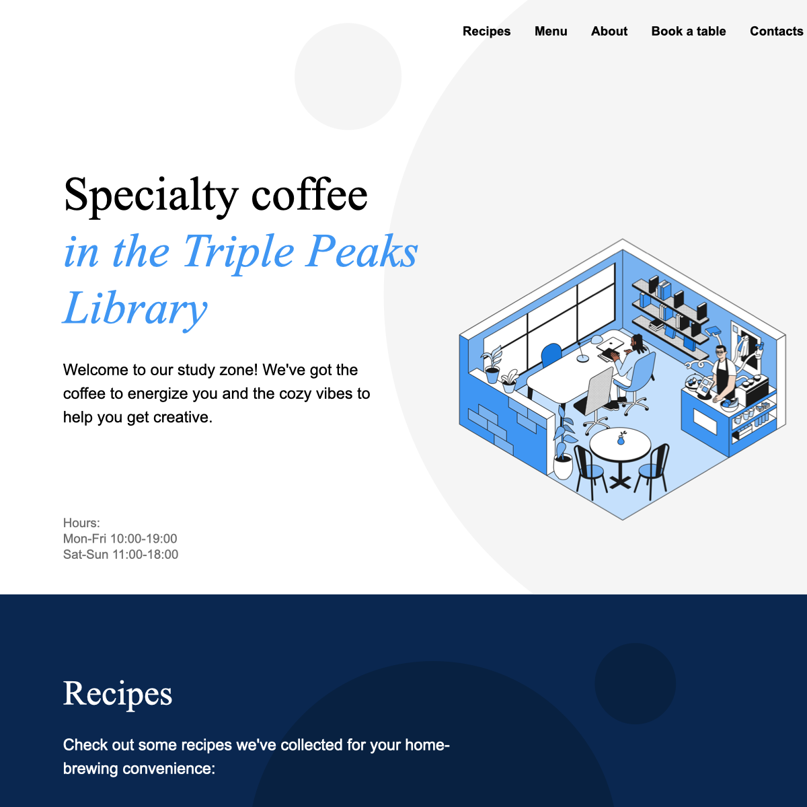
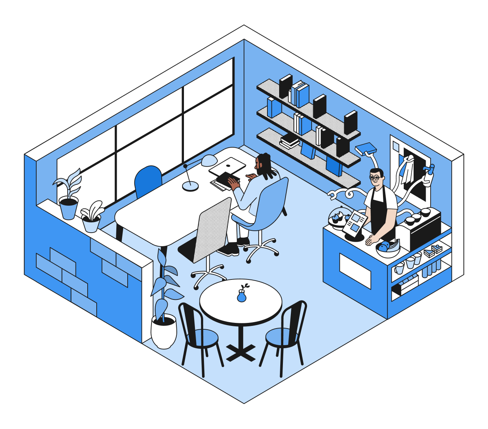

# PJ Beans Coffee Shop

PJ Beans Coffee Shop is a single-page website for a specialty coffee shop
located inside the Triple Peaks Library. The page introduces visitors to the
shop, highlights brewing recipe videos, displays coffee and bakery menu items,
shares contact details, and includes a table reservation form.

## Screenshots

## Project Description

The website is built with semantic HTML5 and modular CSS. It uses a BEM-style
file structure, with separate stylesheets for page sections such as the header,
recipes, menu, about, reservation form, contacts, and footer. The layout uses
Flexbox, custom background images, embedded YouTube videos, Google Fonts,
Normalize.css, and CSS animation for the about section.

Main functionality includes:

- Navigation links to each major page section
- Embedded coffee recipe videos
- Menu cards for coffee and bakery items
- Informational about and contact sections
- Reservation form with required name, guest count, date, time, email, and
  terms fields
- Footer with brand logo and social media links

## Plans for Improvement

Future improvements I would like to add include:

- Make the layout fully responsive for tablet and mobile screen sizes
- Connect the reservation form to a backend service or form submission tool
- Add validation feedback messages after a visitor submits the form
- Replace placeholder social links with real PJ Beans social media pages
- Add seasonal menu items or a featured drink section to make the page feel more
  dynamic
